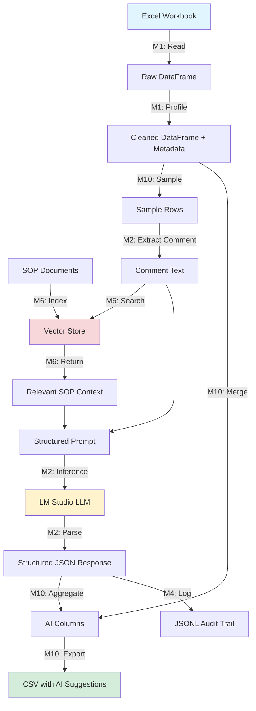
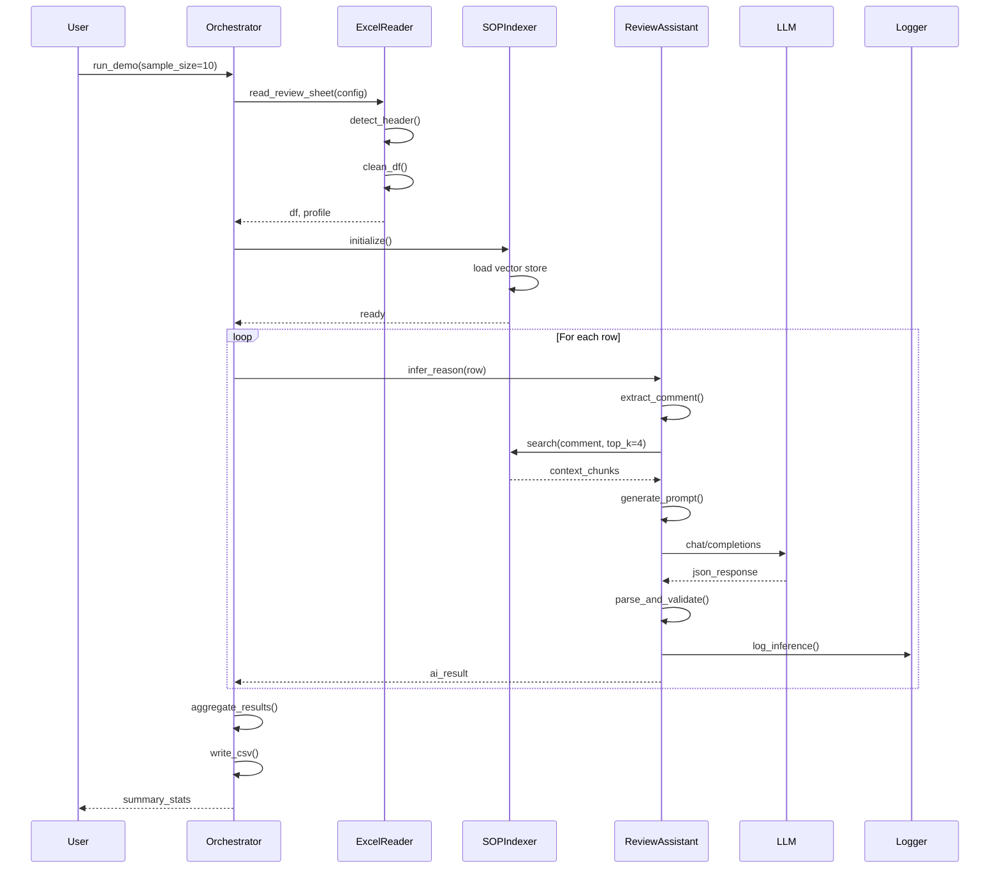

# Agentic AI Architecture for Excel Preprocessing

## Table of Contents
1. [Overview](#overview)
2. [Core Architecture](#core-architecture)
3. [Agentic AI Components](#agentic-ai-components)
4. [Data Flow Diagram](#data-flow-diagram)
5. [Execution Flow with Example](#execution-flow-with-example)
6. [Technical Implementation Details](#technical-implementation-details)
7. [Key Design Principles](#key-design-principles)

---

## Overview

This system implements a **modular agentic AI pipeline** for Excel preprocessing that combines:
- **Safe, read-only Excel ingestion** with automatic header detection
- **RAG (Retrieval-Augmented Generation)** over SOP-like documents
- **Local LLM integration** via LM Studio (no cloud dependencies)
- **Agentic orchestration** with step-by-step reasoning
- **Compliance-focused design** where all AI outputs go to new `AI_*` columns

### What is "Agentic AI"?

In this context, **Agentic AI** refers to an autonomous system that:
1. **Perceives** the environment (reads Excel data, retrieves SOP context)
2. **Reasons** using an LLM with structured prompts
3. **Acts** by generating standardized suggestions
4. **Learns** through logging and correction tracking
5. **Orchestrates** multiple specialized modules to accomplish complex tasks

---

## Core Architecture

The system is built on a **modular agent-based architecture** with specialized components:

```
┌─────────────────────────────────────────────────────────────┐
│                    ORCHESTRATOR (M10)                       │
│              Central Coordination Agent                     │
└─────────────────────┬───────────────────────────────────────┘
                      │
       ┌──────────────┼──────────────┐
       │              │              │
       ▼              ▼              ▼
┌──────────┐   ┌──────────┐   ┌──────────┐
│ Excel    │   │ Review   │   │ SOP      │
│ Reader   │   │ Assistant│   │ Indexer  │
│ (M1)     │   │ (M2)     │   │ (M6)     │
└──────────┘   └──────────┘   └──────────┘
     │              │              │
     │              │              │
     ▼              ▼              ▼
┌──────────────────────────────────────┐
│         Local LLM (LM Studio)        │
│      + Vector Store (ChromaDB)       │
└──────────────────────────────────────┘
```

### Module Descriptions

#### **M1: Excel Reader Agent**
- **Purpose**: Safe, read-only ingestion of Excel workbooks
- **Capabilities**:
  - Automatic header row detection using heuristics
  - Intelligent column name normalization
  - Data profiling (missing rate, column types)
  - CSV preview export for downstream processing
- **Compliance**: Never modifies source files

#### **M2: Review Assistant Agent**
- **Purpose**: AI-powered analysis of review comments
- **Capabilities**:
  - RAG-based context retrieval from SOP documents
  - LLM inference with structured prompts
  - Standardized output generation (reason, confidence, rationale)
  - Full audit trail via JSONL logging
- **Intelligence**: Uses local LLM to understand comment semantics

#### **M6: SOP Indexer (RAG Component)**
- **Purpose**: Vector-based document retrieval
- **Capabilities**:
  - Semantic chunking of SOP documents (PDF/DOCX)
  - Vector embedding using Sentence Transformers
  - Similarity search using ChromaDB or FAISS
  - Automatic SOP reference mapping
- **AI Technique**: Embedding-based semantic search

#### **M10: Orchestrator Agent**
- **Purpose**: End-to-end pipeline coordination
- **Capabilities**:
  - Step-by-step execution with logging
  - Error handling and recovery
  - Results aggregation
  - Performance metrics tracking
- **Role**: Master agent that coordinates sub-agents

---

## Agentic AI Components

### 1. Perception Layer (Data Ingestion)

```python
# Excel Reader - Perceives the data environment
def read_review_sheet(config):
    # Automatic header detection
    df_raw = pd.read_excel(xlsx, header=None)
    header_idx = _detect_header(df_raw)
    
    # Re-read with detected header
    df = pd.read_excel(xlsx, header=header_idx)
    df = _clean_df(df)  # Normalize and clean
    
    # Profile the data
    profile = _profile(df, sheet_name, header_idx)
    return df, profile
```

**Agentic Behavior**: Automatically adapts to different Excel formats by detecting headers intelligently.

### 2. Knowledge Base (RAG System)

```python
# SOP Indexer - Builds semantic knowledge base
class SOPIndexer:
    def __init__(self, embeddings_dir, model_name):
        self.embedder = SentenceTransformer(model_name)
        self.vector_store = ChromaVectorStore(embeddings_dir)
    
    def load_and_index(self, doc_paths):
        # Load documents (PDF/DOCX)
        docs = self.load_docs(doc_paths)
        
        # Semantic chunking
        chunks = self.chunk_and_clean(docs)
        
        # Generate embeddings and index
        self.embed_and_index(chunks)
    
    def search(self, query, top_k=3):
        # Semantic similarity search
        query_embedding = self.embedder.encode([query])
        results = self.vector_store.query(query_embedding, top_k)
        return results
```

**Agentic Behavior**: Builds a semantic understanding of SOPs, enabling context-aware retrieval.

### 3. Reasoning Layer (LLM Agent)

```python
# Review Assistant - Reasons about comments
class ReviewAssistant:
    def infer_reason(self, row):
        # 1. Extract comment
        comment = row['Site Review']
        
        # 2. Retrieve relevant SOP context (RAG)
        context_chunks = self.sop_indexer.search(comment, top_k=4)
        context_text = "\n\n".join([chunk['content'] for chunk in context_chunks])
        
        # 3. Generate structured prompt
        prompt = self._generate_prompt(comment, context_text)
        
        # 4. Call LLM for reasoning
        llm_response = self._call_lm_studio(prompt)
        
        # 5. Parse and validate structured output
        parsed = self._parse_json_response(llm_response)
        
        # 6. Return AI inference
        return {
            'AI_reason': parsed['reason'],
            'AI_confidence': parsed['confidence'],
            'AI_comment_standardized': parsed['comment_standardized'],
            'AI_rationale_short': parsed['rationale_short'],
            'AI_model_version': parsed['model_version']
        }
```

**Agentic Behavior**: 
- Contextual understanding via RAG
- Structured reasoning via LLM
- Confidence scoring for self-awareness

### 4. Action Layer (Output Generation)

```python
# Orchestrator - Executes actions
class ExcelReviewOrchestrator:
    def run_demo(self, sample_size=10):
        # STEP 1: Load configuration
        config = load_config()
        
        # STEP 2: Read Excel data
        df, profile = read_review_sheet(config)
        
        # STEP 3: Initialize RAG context
        sop_indexer = SOPIndexer(embeddings_dir="data/embeddings")
        
        # STEP 4: Process each row with LLM
        ai_results = []
        for idx, row in df.iterrows():
            result = self.review_assistant.infer_reason(row)
            ai_results.append(result)
        
        # STEP 5: Add AI columns to DataFrame
        ai_df = pd.DataFrame(ai_results)
        df_with_ai = pd.concat([df, ai_df], axis=1)
        
        # STEP 6: Write output to CSV
        df_with_ai.to_csv('out/excel_review_demo.csv')
        
        # STEP 7: Log all inferences
        self._log_step(...)
        
        return summary
```

**Agentic Behavior**: Sequential task execution with error handling and logging.

---

## Data Flow Diagram

### High-Level Flow



### Detailed Component Interaction



---

## Execution Flow with Example

### Sample Excel Data

**Input: Review Workbook (ReviewSheet)**

| Row | Site | Date | Site Review | Status |
|-----|------|------|-------------|--------|
| 1 | Site A | 2024-01-15 | Equipment not calibrated according to SOP-123456. Missing calibration certificate for temperature sensor. | Open |
| 2 | Site B | 2024-01-16 | Documentation incomplete - missing batch number on label | Open |
| 3 | Site C | 2024-01-17 | Equipment not properly maintained according to maintenance schedule | Open |

### Step-by-Step Execution

#### **STEP 1: Configuration Loading**

```python
config = load_config()
# Output:
# {
#   "input_file": "data/Sample_Review_Workbook.xlsx",
#   "sheet_name": "ReviewSheet",
#   "out_dir": "out",
#   "lm_studio_url": "http://127.0.0.1:1234/v1"
# }
```

#### **STEP 2: Excel Reading & Profiling**

```python
df, profile = read_review_sheet(config)

# Profile Output:
# SheetProfile(
#   sheet_name='ReviewSheet',
#   header_row_index=0,
#   row_count=3,
#   col_count=5,
#   columns=['Row', 'Site', 'Date', 'Site Review', 'Status'],
#   missing_rate_by_col={'Row': 0.0, 'Site': 0.0, 'Date': 0.0, 
#                        'Site Review': 0.0, 'Status': 0.0}
# )
```

**Agentic Decision**: Reader detected header at row 0 and normalized column names.

#### **STEP 3: RAG Context Building**

```python
sop_indexer = SOPIndexer(embeddings_dir="data/embeddings")
# Loads pre-built vector index with SOP documents

# Example: Search for context
comment = "Equipment not calibrated according to SOP-123456"
context_chunks = sop_indexer.search(comment, top_k=4)

# Context Chunks Retrieved:
# [
#   {
#     "content": "4.1.3 Equipment Calibration Requirements\n
#                All measuring equipment must be calibrated annually...",
#     "similarity": 0.87,
#     "metadata": {
#       "doc_id": "123456",
#       "section": "4.1.3",
#       "title": "Equipment Calibration SOP"
#     }
#   },
#   {
#     "content": "5.2 Calibration Certificate Documentation\n
#                Each calibration must be accompanied by a certificate...",
#     "similarity": 0.82,
#     "metadata": {...}
#   },
#   ...
# ]
```

**Agentic Behavior**: RAG system automatically retrieves the 4 most relevant SOP sections based on semantic similarity.

#### **STEP 4: LLM Reasoning**

**Example for Row 1:**

**Prompt Generated:**
```
System:
You are an expert in analyzing Excel review comments following documented SOPs...

Instruction:
Given the comment below and relevant SOP context, return a JSON object...

Comment: Equipment not calibrated according to SOP-123456. Missing calibration certificate for temperature sensor.

Context: 
4.1.3 Equipment Calibration Requirements
All measuring equipment must be calibrated annually...

5.2 Calibration Certificate Documentation
Each calibration must be accompanied by a certificate...
```

**LLM Response:**
```json
{
  "reason": "Missing Calibration Certificate",
  "confidence": 0.92,
  "comment_standardized": "Equipment calibration incomplete - temperature sensor missing calibration certificate per SOP-123456 Section 4.1.3",
  "rationale_short": "Comment clearly identifies missing calibration documentation for specific equipment, matching SOP requirement for annual calibration certificates",
  "model_version": "ExcelReview-v0.1"
}
```

**Agentic Reasoning**:
1. LLM understood the technical context (calibration)
2. Retrieved relevant SOP sections via RAG
3. Generated standardized classification
4. Provided confidence score (self-awareness)
5. Explained reasoning (interpretability)

#### **STEP 5: Result Aggregation**

```python
# AI columns added to original DataFrame
df_with_ai = pd.concat([df, ai_df], axis=1)

# Output DataFrame:
```

| Row | Site | Date | Site Review | Status | AI_reason | AI_confidence | AI_comment_standardized | AI_rationale_short | AI_model_version |
|-----|------|------|-------------|--------|-----------|---------------|------------------------|-------------------|------------------|
| 1 | Site A | 2024-01-15 | Equipment not calibrated... | Open | Missing Calibration Certificate | 0.92 | Equipment calibration incomplete... | Comment clearly identifies... | ExcelReview-v0.1 |
| 2 | Site B | 2024-01-16 | Documentation incomplete... | Open | Incomplete Documentation | 0.88 | Documentation deficiency... | Missing required batch number... | ExcelReview-v0.1 |
| 3 | Site C | 2024-01-17 | Equipment not properly maintained... | Open | Equipment Maintenance Issue | 0.85 | Equipment maintenance non-compliance... | Deviation from maintenance schedule... | ExcelReview-v0.1 |

**Agentic Output**: All original data preserved, AI suggestions added as new columns with `AI_` prefix.

#### **STEP 6: Audit Logging**

```jsonl
{"timestamp": "2024-01-20T10:30:15", "row_id": 1, "original_comment": "Equipment not calibrated...", "context_chunks": 4, "response": {"reason": "Missing Calibration Certificate", "confidence": 0.92}, "model_version": "ExcelReview-v0.1"}
{"timestamp": "2024-01-20T10:30:18", "row_id": 2, "original_comment": "Documentation incomplete...", "context_chunks": 4, "response": {"reason": "Incomplete Documentation", "confidence": 0.88}, "model_version": "ExcelReview-v0.1"}
{"timestamp": "2024-01-20T10:30:21", "row_id": 3, "original_comment": "Equipment not properly maintained...", "context_chunks": 4, "response": {"reason": "Equipment Maintenance Issue", "confidence": 0.85}, "model_version": "ExcelReview-v0.1"}
```

**Agentic Traceability**: Every LLM inference is logged with input, output, context, and metadata.

#### **STEP 7: Summary Statistics**

```python
summary = {
    'rows_processed': 3,
    'avg_confidence': 0.883,
    'output_file': 'out/excel_review_demo.csv',
    'log_file': 'logs/review_assistant.jsonl'
}
```

---

## Technical Implementation Details

### 1. RAG Implementation

**Embedding Model**: `all-MiniLM-L6-v2` (Sentence Transformers)
- Dimension: 384
- Local inference (no API calls)
- Fast encoding (~50ms per sentence)

**Vector Store**: ChromaDB (default) or FAISS
- Persistent storage
- Efficient similarity search (cosine distance)
- Metadata filtering support

**Chunking Strategy**:
```python
def chunk_and_clean(self, docs):
    # Semantic chunking by section headers
    section_pattern = re.compile(r'^(?:\d+(?:\.\d+)*\s+|Attachment\s+)')
    
    # Split by sections
    matches = list(section_pattern.finditer(doc.content))
    
    # Create chunks with context
    for i, match in enumerate(matches):
        section_content = doc.content[match.start():next_section_start]
        
        # Further split if too long (max 1600 chars)
        sub_chunks = self._split_long_content(section_content, max_length=1600)
        
        # Preserve metadata (section ID, title, page, doc_id)
        chunks.append(Chunk(content=sub_chunk, section=section_id, ...))
```

**Key Features**:
- Maintains section context
- Prevents splitting mid-sentence
- Preserves document metadata
- Deduplication by checksum

### 2. LLM Integration

**LM Studio API**:
```python
def _call_lm_studio(self, prompt):
    payload = {
        "model": "local-model",
        "messages": [{"role": "user", "content": prompt}],
        "temperature": 0.1,  # Low temperature for consistency
        "max_tokens": 500,
        "stream": False
    }
    
    response = requests.post(
        f"{self.lm_studio_url}/chat/completions",
        json=payload,
        timeout=30
    )
    
    return response.json()["choices"][0]["message"]["content"]
```

**Structured Output Parsing**:
```python
def _parse_json_response(self, response):
    # Try direct JSON parsing
    try:
        return json.loads(response)
    except JSONDecodeError:
        # Extract JSON from markdown code blocks
        if "```json" in response:
            json_start = response.find("```json") + 7
            json_end = response.find("```", json_start)
            json_str = response[json_start:json_end].strip()
            return json.loads(json_str)
        
        # Fallback: extract content between {}
        start = response.find("{")
        end = response.rfind("}") + 1
        return json.loads(response[start:end])
```

**Error Handling**:
- Retries on connection failures
- Fallback values for parsing errors
- Low confidence scores for errors
- Full error logging

### 3. Orchestration Pattern

**Step Logging**:
```python
def _log_step(self, step_num, step_name, message, data=None):
    log_entry = {
        "step": step_num,
        "name": step_name,
        "message": message,
        "timestamp": datetime.now().isoformat(),
        "data": data or {}
    }
    self.step_logs.append(log_entry)
    print(f"[STEP {step_num}] {step_name}: {message}")
```

**Error Recovery**:
```python
try:
    result = self.review_assistant.infer_reason(row)
    ai_results.append(result)
except Exception as e:
    # Log error and continue with next row
    logger.error(f"Error processing row {idx}: {e}")
    ai_results.append({
        'AI_reason': f'Error: {str(e)}',
        'AI_confidence': 0.0,
        ...
    })
```

**Performance Tracking**:
- Row-level processing time
- Average confidence scores
- Success/failure rates
- Resource utilization

---

## Key Design Principles

### 1. Agentic Autonomy
- **Self-Contained Modules**: Each module (M1, M2, M6, M10) operates independently
- **Automatic Adaptation**: Header detection, semantic chunking, context retrieval
- **Goal-Oriented**: Orchestrator drives toward end goal (complete Excel analysis)

### 2. Structured Reasoning
- **RAG-Enhanced**: LLM has access to relevant SOP knowledge
- **Prompt Engineering**: Structured prompts with clear instructions
- **Confidence Scoring**: AI expresses uncertainty quantitatively
- **Explainable Output**: Rationale field explains reasoning

### 3. Safety & Compliance
- **Read-Only Access**: Never modifies source Excel files
- **Non-Destructive Output**: AI columns use `AI_` prefix
- **Full Audit Trail**: JSONL logging for every inference
- **Local Inference**: No data sent to cloud APIs
- **Human-in-the-Loop**: AI provides suggestions, humans make decisions

### 4. Modularity & Extensibility
- **Plugin Architecture**: Easy to add new modules (M12+)
- **Model Agnostic**: Works with any OpenAI-compatible LLM
- **Vector Store Flexibility**: ChromaDB or FAISS
- **Configurable Pipeline**: JSON configuration for all parameters

### 5. Production-Grade Design
- **Error Handling**: Graceful degradation on failures
- **Logging**: Comprehensive debugging information
- **Performance Monitoring**: Metrics for optimization
- **Testing**: Module-level and integration tests

---

## Example Use Cases

### Use Case 1: Monthly Quality Review
**Scenario**: QA team needs to review 500+ rows of site inspection comments

**Before Agentic AI**:
- Manual classification (2-3 hours)
- Inconsistent categorization
- No SOP reference linking
- No audit trail

**After Agentic AI**:
- Automated initial classification (5 minutes)
- Standardized taxonomy
- Automatic SOP clause mapping
- Complete JSONL audit trail
- Human review of AI suggestions (30 minutes)

**Result**: 70% time savings, improved consistency

### Use Case 2: Compliance Audit Preparation
**Scenario**: Need to demonstrate SOP compliance for 12 months of reviews

**Agentic AI Benefits**:
- RAG system automatically links comments to SOP clauses
- Confidence scores identify low-certainty cases
- JSONL logs provide complete audit trail
- Model card documents AI system capabilities
- Correction tracker shows AI vs. human agreement rates

### Use Case 3: Cross-Site Analysis
**Scenario**: Identify common issues across multiple sites

**Agentic AI Benefits**:
- Standardized comment classification enables aggregation
- Semantic search finds similar issues across sites
- Taxonomy mapping enables trend analysis
- Publication agent generates automated reports

---

## Comparison: Traditional vs. Agentic AI

| Aspect | Traditional Scripting | Agentic AI Implementation |
|--------|----------------------|---------------------------|
| **Excel Reading** | Fixed header row | Automatic header detection |
| **Comment Analysis** | Keyword matching | Semantic understanding via LLM |
| **SOP Lookup** | Manual or keyword search | RAG-based semantic retrieval |
| **Classification** | Rule-based | Context-aware reasoning |
| **Adaptability** | Breaks on format changes | Self-adapts to variations |
| **Explainability** | No explanation | Rationale + confidence scores |
| **Traceability** | Limited logging | Complete audit trail |
| **Scalability** | Linear with rules | Scales with data via ML |

---

## Future Enhancements

### Planned Agentic Capabilities

1. **Multi-Agent Collaboration** (M12)
   - Specialist agents for different SOP domains
   - Agent-to-agent communication
   - Consensus-based decision making

2. **Active Learning** (M13)
   - Feedback loop from human corrections
   - Model fine-tuning on correction data
   - Adaptive confidence thresholds

3. **Proactive Monitoring** (M14)
   - Drift detection in comment patterns
   - Anomaly detection for unusual cases
   - Automated alert generation

4. **Meta-Reasoning** (M15)
   - Agent reflects on its own performance
   - Self-adjusting parameters
   - Capability-aware task routing

---

## Conclusion

This **Agentic AI implementation** for Excel preprocessing demonstrates:

✅ **Autonomous operation** through intelligent header detection, semantic chunking, and context retrieval  
✅ **Structured reasoning** via RAG + LLM with confidence scoring  
✅ **Modular design** with specialized agents for different tasks  
✅ **Production readiness** with comprehensive logging, error handling, and compliance features  
✅ **Human collaboration** through explainable outputs and assistive mode  

The system transforms manual, rule-based Excel preprocessing into an **intelligent, adaptive, and auditable** process powered by modern AI techniques.

---

**Author**: Navid Broumandfar  
**Version**: 1.0  
**Date**: 2024  
**License**: MIT
