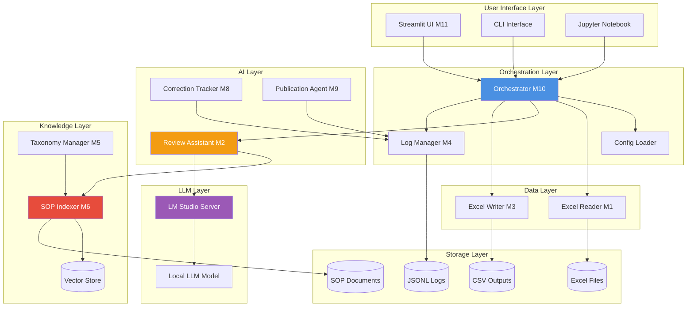
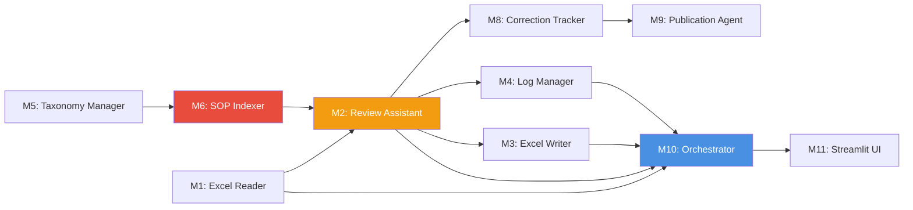
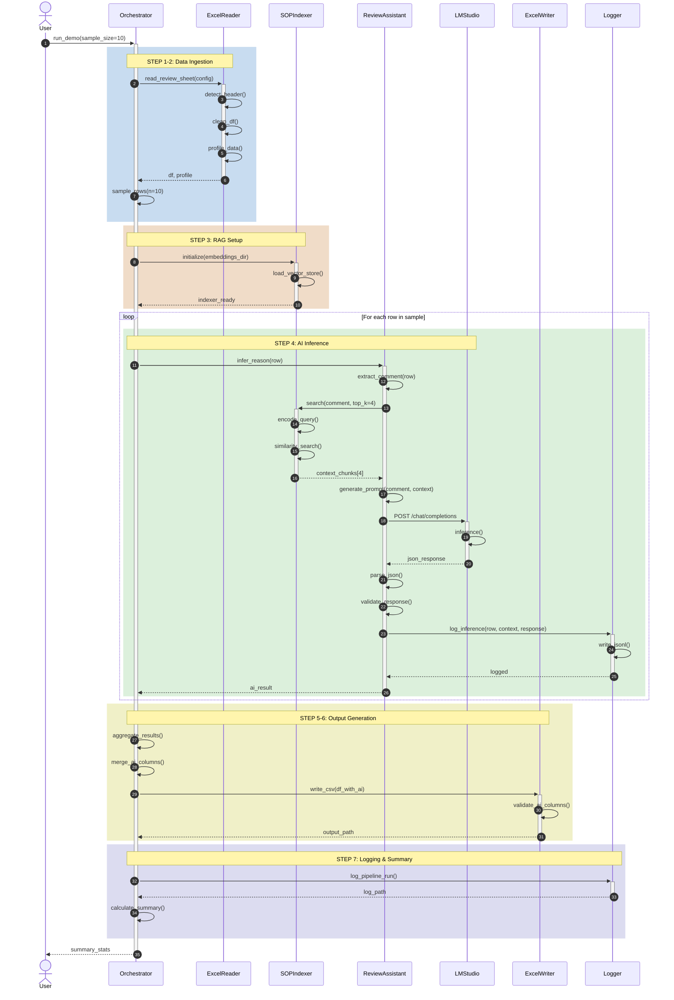
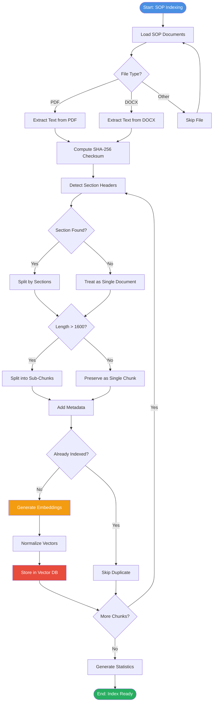
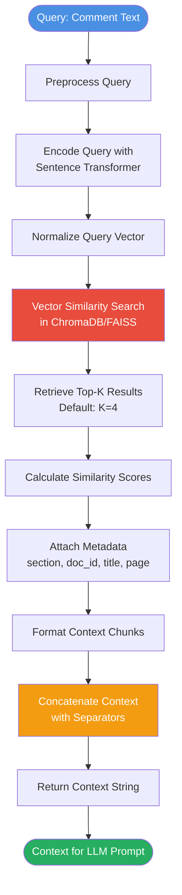
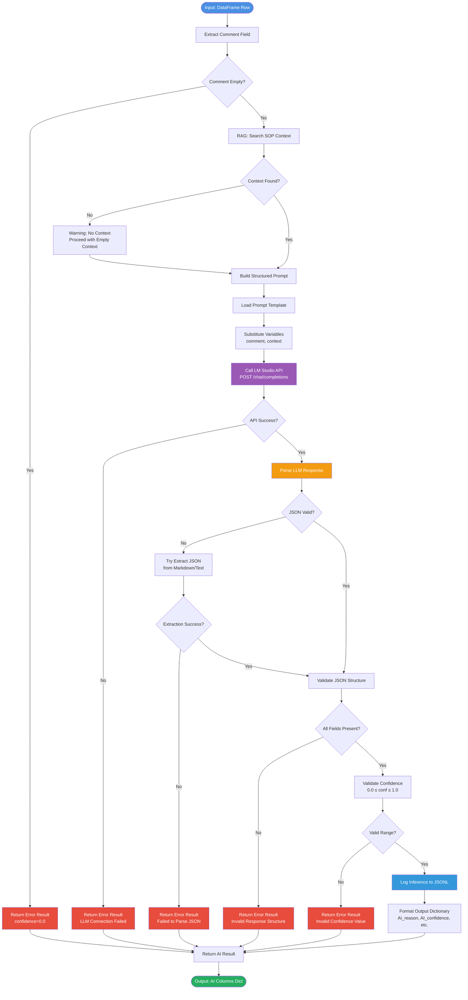
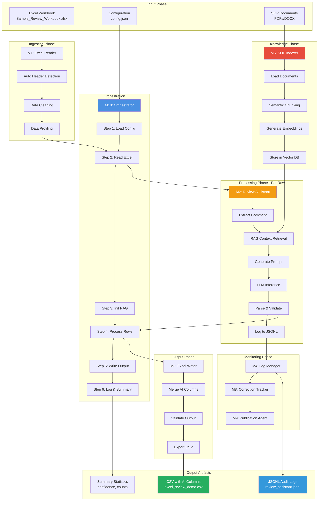
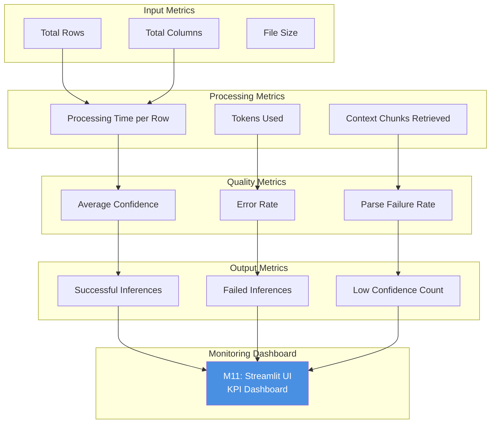

# Agentic AI Flow Diagrams

This document provides detailed visual representations of the Agentic AI architecture and execution flows for Excel preprocessing.

## Table of Contents
1. [System Architecture Overview](#system-architecture-overview)
2. [Module Interaction Flow](#module-interaction-flow)
3. [RAG Pipeline Flow](#rag-pipeline-flow)
4. [LLM Inference Flow](#llm-inference-flow)
5. [End-to-End Processing Flow](#end-to-end-processing-flow)

---

## System Architecture Overview

### High-Level Component Architecture



### Module Dependencies



---

## Module Interaction Flow

### Complete Processing Pipeline



---

## RAG Pipeline Flow

### Document Indexing Process



### RAG Retrieval Process



---

## LLM Inference Flow

### Review Assistant Processing



### LLM JSON Response Parsing

```mermaid
flowchart TD
    START([LLM Response String]) --> STRIP[Strip Whitespace]
    
    STRIP --> TRY_DIRECT[Try Direct JSON Parse]
    
    TRY_DIRECT --> DIRECT_OK{Success?}
    
    DIRECT_OK -->|Yes| RETURN_JSON[Return Parsed JSON]
    DIRECT_OK -->|No| CHECK_MARKDOWN{Contains ```json?}
    
    CHECK_MARKDOWN -->|Yes| EXTRACT_MD[Extract from Markdown<br/>Code Block]
    CHECK_MARKDOWN -->|No| FIND_BRACES[Find { and } positions]
    
    EXTRACT_MD --> PARSE_MD[Parse Extracted String]
    
    PARSE_MD --> MD_OK{Success?}
    
    MD_OK -->|Yes| RETURN_JSON
    MD_OK -->|No| FIND_BRACES
    
    FIND_BRACES --> BRACES_FOUND{Braces Found?}
    
    BRACES_FOUND -->|Yes| EXTRACT_JSON[Extract String<br/>Between Braces]
    BRACES_FOUND -->|No| CLEAN_RESPONSE[Clean Response<br/>Remove Escapes]
    
    EXTRACT_JSON --> PARSE_EXTRACTED[Parse Extracted String]
    
    PARSE_EXTRACTED --> EXTRACT_OK{Success?}
    
    EXTRACT_OK -->|Yes| RETURN_JSON
    EXTRACT_OK -->|No| CLEAN_RESPONSE
    
    CLEAN_RESPONSE --> PARSE_CLEAN[Parse Cleaned String]
    
    PARSE_CLEAN --> CLEAN_OK{Success?}
    
    CLEAN_OK -->|Yes| RETURN_JSON
    CLEAN_OK -->|No| LOG_ERROR[Log Parsing Error]
    
    LOG_ERROR --> RETURN_NULL[Return None]
    
    RETURN_JSON --> END([Parsed JSON Dict])
    RETURN_NULL --> END
    
    style START fill:#4A90E2,color:#fff
    style END fill:#27AE60,color:#fff
    style RETURN_NULL fill:#E74C3C,color:#fff
    style TRY_DIRECT fill:#F39C12,color:#fff
```

---

## End-to-End Processing Flow

### Complete Agentic Pipeline



### Data Transformation Flow

```mermaid
graph LR
    subgraph "Stage 1: Raw Excel"
        RAW[Raw Excel Data<br/>Unknown header position<br/>Mixed data types<br/>Empty rows/columns]
    end
    
    subgraph "Stage 2: Cleaned DataFrame"
        CLEAN[Cleaned DataFrame<br/>Header detected at row 0<br/>Normalized columns<br/>Empty rows removed<br/>Profile generated]
    end
    
    subgraph "Stage 3: Sampled Data"
        SAMPLE[Sample N Rows<br/>For processing<br/>With comments<br/>Quality Review column]
    end
    
    subgraph "Stage 4: Context-Enriched"
        ENRICHED[Rows + SOP Context<br/>Each row has 4 context chunks<br/>From vector similarity search<br/>Relevant SOP sections]
    end
    
    subgraph "Stage 5: AI-Analyzed"
        ANALYZED[Rows + AI Columns<br/>AI_reason<br/>AI_confidence<br/>AI_comment_standardized<br/>AI_rationale_short<br/>AI_model_version]
    end
    
    subgraph "Stage 6: Final Output"
        OUTPUT[CSV with All Columns<br/>Original + AI columns<br/>Audit trail in JSONL<br/>Summary statistics]
    end
    
    RAW -->|Excel Reader M1| CLEAN
    CLEAN -->|Orchestrator M10| SAMPLE
    SAMPLE -->|RAG M6| ENRICHED
    ENRICHED -->|Review Assistant M2| ANALYZED
    ANALYZED -->|Excel Writer M3| OUTPUT
    
    style RAW fill:#E8E8E8
    style CLEAN fill:#D5E8F7
    style SAMPLE fill:#C7E2F4
    style ENRICHED fill:#B9DCF1
    style ANALYZED fill:#ABD6EE
    style OUTPUT fill:#27AE60,color:#fff
```



---

## Agentic Decision Points

### Intelligence in the Pipeline

```mermaid
flowchart TD
    START([Excel File]) --> AGENT1{Agent 1: Header Detection}
    
    AGENT1 -->|Heuristic: Max Non-Empty Count| DEC1[Decision: Header at Row X]
    
    DEC1 --> AGENT2{Agent 2: Data Cleaning}
    
    AGENT2 -->|Rule: Drop Empty Cols/Rows| DEC2[Decision: Keep N Columns]
    
    DEC2 --> AGENT3{Agent 3: Context Retrieval}
    
    AGENT3 -->|Semantic: Vector Similarity| DEC3[Decision: Top-4 SOP Sections]
    
    DEC3 --> AGENT4{Agent 4: LLM Reasoning}
    
    AGENT4 -->|Reasoning: RAG + Prompt| DEC4[Decision: Standardized Reason]
    
    DEC4 --> AGENT5{Agent 5: Confidence Scoring}
    
    AGENT5 -->|Self-Assessment| DEC5[Decision: Confidence 0.0-1.0]
    
    DEC5 --> AGENT6{Agent 6: Error Handling}
    
    AGENT6 -->|Exception Handling| DEC6[Decision: Continue or Fail Gracefully]
    
    DEC6 --> END([Output with AI Suggestions])
    
    style AGENT1 fill:#4A90E2,color:#fff
    style AGENT2 fill:#4A90E2,color:#fff
    style AGENT3 fill:#F39C12,color:#fff
    style AGENT4 fill:#9B59B6,color:#fff
    style AGENT5 fill:#E74C3C,color:#fff
    style AGENT6 fill:#27AE60,color:#fff
```



---

## Performance & Monitoring

### Pipeline Metrics Flow



---

## Conclusion

These diagrams illustrate the **comprehensive agentic architecture** where:

1. **Multiple specialized agents** work together (Excel Reader, SOP Indexer, Review Assistant, Orchestrator)
2. **Intelligent decision-making** happens at each stage (header detection, semantic search, LLM reasoning)
3. **Robust error handling** ensures graceful degradation
4. **Complete traceability** through logging and monitoring
5. **Modular design** allows independent testing and replacement of components

The system demonstrates true **agentic behavior** through autonomous operation, structured reasoning, and self-awareness (confidence scoring).

---

**See Also**: 
- [AGENTIC_AI_ARCHITECTURE.md](./AGENTIC_AI_ARCHITECTURE.md) - Detailed architecture documentation
- [Project_Structure.md](./Project_Structure.md) - Module organization
- [LM_STUDIO_SETUP.md](./LM_STUDIO_SETUP.md) - LLM setup guide
